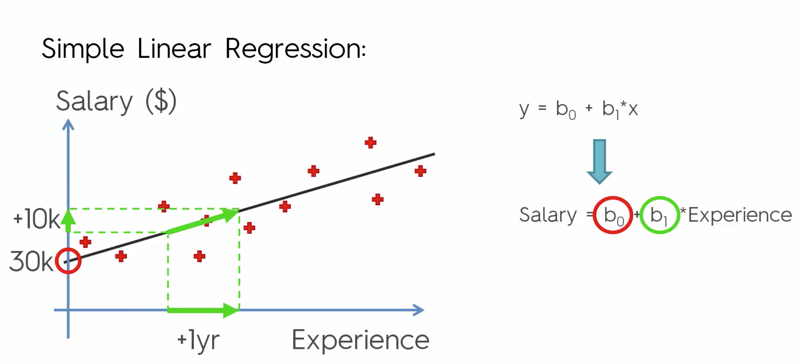
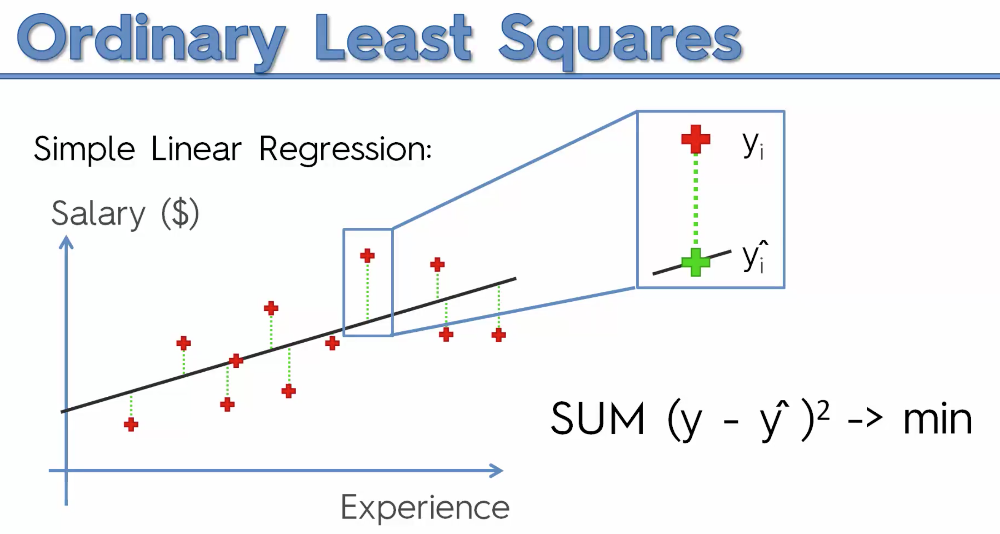
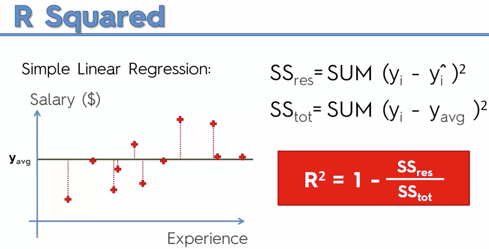
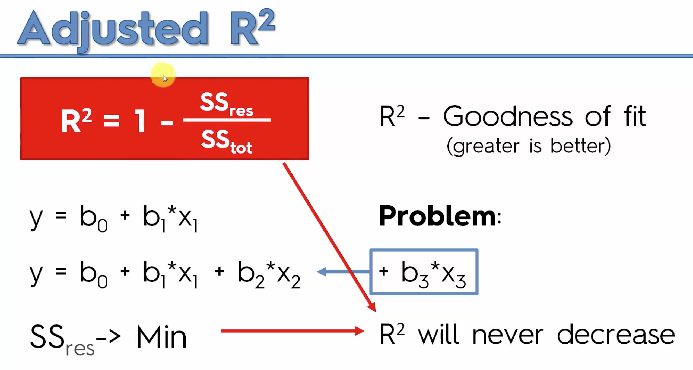
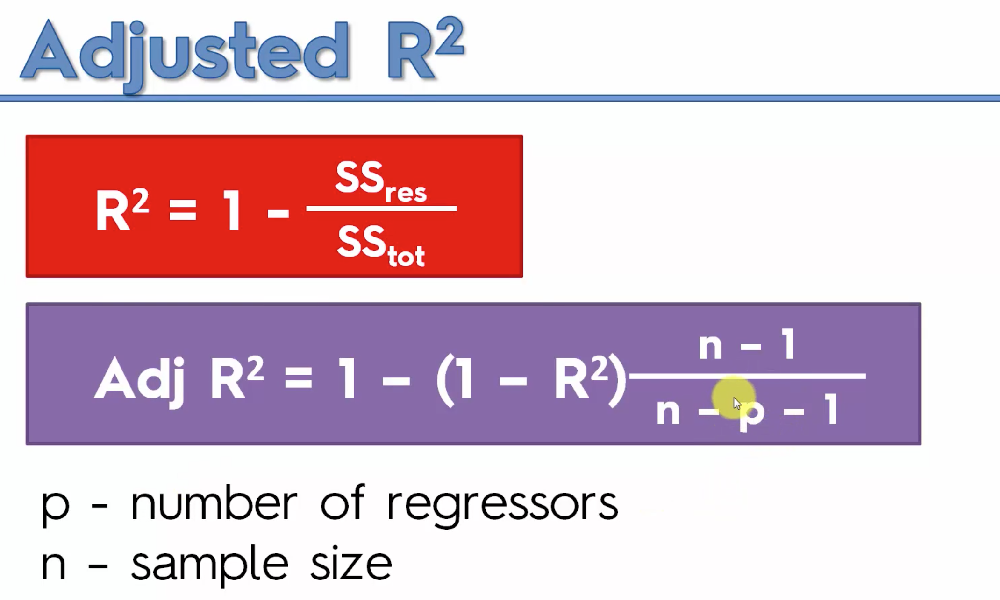

# Regression

##Linear

###Simple Linear Regression:

$$
y = b_0 + b_1 * x_1
$$

y: Dependent variable (DV)
$$
x_1, x_2, x_3 ... x_n \ are \  Independent \  Variabls
$$

### Multiple Linear Regression:

$$
y = b_0 + b_1 * x_1 + b_2 * x_2 + ... + b_n * x_n
$$

## Logistic:

### Simple Logistic Regression:

### Multiple Logistic Regression:

 ## Ordinary Least Squares

## R Squared

basically R squared demonstrates how well your model fit for your data

## Adjusted R Squared

 

p is the number of independent variables

